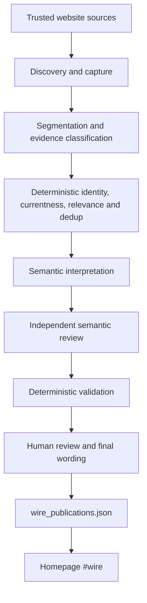

# Lineup Beat NFL Wire: complete engineering handoff

Last verified: 2026-08-24

## 2026-08-28 curated-digest transition

The reader-facing Wire is migrating from individual impact cards to one
concise chronological digest. Trusted standalone X and official-team reports
are reviewed in one batch. ChatGPT selects and deduplicates factual updates,
but that selection has no publication authority. The final numbered bullets
are bound into an immutable manifest; only an explicit comment from the
allow-listed `rdamato720` account may append them to
`data/wire_digest_publications.json`. The homepage then renders one bullet and
one source link per row. Existing approved card publications remain intact as
a hidden rollback aid during the migration. Pending evidence, rejection
diagnostics and model output never reach the public page.

Repository: `rdamato720/lineupbeat`

Baseline containing the semantic-boundary repair: `1dfa6f5`

Public destination: `https://lineupbeat.com/#wire`

## 1. What this system is

The NFL Wire turns reporting from trusted sources into concise,
fantasy-relevant homepage cards. It is not a general news scraper, a projection
engine, or an autonomous publisher.

Each card answers two different questions:

1. **What changed or what is the source's take?** One short, human-approved
   sentence, explicitly labelled `What changed` or `Fantasy analysis`.
2. **Lineup Beat impact.** A separate, human-approved fantasy interpretation
   that states what the evidence supports and what it does not establish.

The Wire may display existing positional rank, ADP, and projected points, but
those values are a display-only join. The evidence pipeline neither modifies
them nor sends them to a model.

## 2. Current production state

At this checkpoint:

- The homepage publication file contains nine reviewed cards.
- Nothing in the new semantic-review repair automatically publishes.
- The Wire list is homepage-only. Legacy `/nfl/wire` and `/nfl/wire/` routes
  belong on redirects to `/#wire`, not in navigation or the sitemap. The
  newest final, human-approved summary and Lineup Beat impact may also appear
  on the matching canonical player page after stable identity resolution:
  player id, or an exact name + team + position crosswalk between registries.
  No draft, raw evidence passage, or separate Wire archive may appear there.
- Cards are one per row, not two or three columns.
- Player photos, team logos, team colours, mechanism, direction, position
  rank, ADP, projection, relative time, and attribution are preserved when a
  real value exists.
- Public evidence is a single approved sentence capped by the public-summary
  validator. The full evidence passage remains in the evidence store and
  review artifacts, not on the homepage.
- League News, the separate video strip, Fantasy Data, and Moving Now were
  removed from the homepage. Recent News remains.
- YouTube is paused in `sources/wire_youtube.yaml`. Its registry, cache, budget
  controls, and tests remain, but production must spend no caption or model
  calls on video evidence.
- `sources/wire_articles.yaml` currently loads 80 registered article sources;
  the last verified health run reported 74 active sources and zero fatal
  problems.
- `data/wire_publications.json` is the only Wire publication input read by the
  public builder. Evidence candidates and review artifacts are not public.

Six records in `data/wire_publications.json` are the historical reviewed launch
set. Three more cards (Jakobi Meyers, Matthew Golden, and Tre Harris) were
published with Ralph's exact final-summary and final-commentary approvals on
2026-08-24. Do not infer that the historical six would pass a newly invented
rule without a migration and explicit review. Existing human decisions are
data, not fixtures to rewrite casually.

## 3. High-level architecture



There is no valid path from E or F directly to I.

## 4. Repository map

| Area | Purpose |
|---|---|
| `sources/wire_articles.yaml` | Article-source registry, filters, ownership, paid/blocked state |
| `sources/wire_si_authors.json` | Researched SI/On SI author classifications |
| `sources/wire_players.json` | Wire-only stable identity registry |
| `sources/wire_youtube.yaml` | Paused video registry and transcript safeguards |
| `wire/capture.py` | Fetch and extraction policy |
| `wire/segment.py` | Evidence boundaries: headings, bullets, dated entries, observations |
| `wire/evidence.py` | Evidence classification and relay/authority handling |
| `wire/currentness.py` | Rolling-page detection and event-time eligibility |
| `wire/players.py` | Exact deterministic identity resolution |
| `wire/relevance.py` | Rosterable/evidence-created fantasy relevance gate |
| `wire/claims.py` | Claim identity and deduplication |
| `wire/semantic.py` | Shared interpretation schema and prompt |
| `wire/semantic_validate.py` | Deterministic interpretation validation |
| `wire/evidence_integrity.py` | Evidence-only and request hashing |
| `wire/independent_review.py` | Independent-review schema, validation, deterministic overrides |
| `wire/human_review.py` | Named-human receipt and paid-ledger validation |
| `wire/openai_promotion.py` | Locked-corpus report/receipt promotion validation |
| `wire/providers/` | Rules, Anthropic, OpenAI, and independent-review transports |
| `wire/store.py` | Candidate, impact, decision, audit, and publication persistence |
| `scripts/wire_backfill.py` | Rolling-window discovery/interpretation/reporting |
| `data/wire_paid_candidates.json` | Durable candidate-id ledger written before model requests |
| `data/wire_human_reviews.json` | Append-only named-human dark-launch review receipts |
| `data/wire_openai_promotion.json` | Semantic-promotion receipt bound to corpus/report/pre-publication snapshot hashes |
| `scripts/wire_independent_review.py` | Second-pass review; writes no publications |
| `scripts/wire_review_package.py` | Human-review HTML and JSON package |
| `scripts/wire_publish.py` | Only reviewed-card publication route |
| `scripts/wire_homepage_replacement.py` | Homepage Wire renderer/application logic |
| `scripts/test_wire_review.py` | Focused semantic-boundary regression suite |
| `.github/workflows/refresh.yml` | Scheduled/manual build and deployment pipeline |

## 5. Source model

### 5.1 Source classes

The article registry supports these conceptual classes:

- **Independent local publication.** Best source class when an individually
  researched reporter has repeated evidence access.
- **SI On SI.** Independent from the team but must match both the exact team
  `/onsi/` canonical path and researched author policy. A broad SI team landing
  page is discovery only; its placement does not establish article subject.
- **Official team site.** Authoritative for the club's own transactions,
  designations, and statements. It is team-owned and contributes zero to an
  independent corroboration count.
- **Discovery-only paid source.** May establish that an article exists, but its
  body contributes no evidence. Manual submission cannot bypass the block.
- **Mixed publication.** Requires an explicit team/category/author filter.

### 5.2 Authority is earned, never configured into existence

`reporter_name`, `source_name`, `series_name`, a URL path, or a YAML status is
descriptive metadata. None grants firsthand authority. A reporter becomes
`FIRSTHAND_APPROVED` only after individual research establishes repeated
practice, locker-room, press-conference, or other direct evidence access.

An approved reporter's plain declarative practice sentence may count as an
approved-reporter declaration even when it does not contain a magic phrase
such as "I saw." An unresearched byline does not receive that benefit. Hedges,
relay language, and attribution still override the byline.

### 5.3 Capture first for inclusive review

The inclusive On SI review path keeps opinion, speculation, aggregation,
fantasy advice, ADP arguments, mock drafts, rankings, betting angles,
mailbags, roster predictions and isolated practice notes visible for a human.
None receives firsthand authority merely by being captured. Promotional or
sponsor copy, failed captures and unresolved player identities remain
unpublishable, and their outcomes stay visible in health accounting.

`scripts/wire_inclusive_review.py --hours 24` builds the complete review
catalog with zero model calls and zero publications. This catalog is broader
than the paid semantic funnel by design; semantic suppression must not hide an
item from human editorial review.

## 6. Evidence model

Important evidence classes include:

- `FIRSTHAND_OBSERVATION`: direct observation from approved evidence access.
- `APPROVED_REPORTER_DECLARATION`: a clear unhedged declarative report from an
  approved byline.
- `DIRECT_QUOTATION`: material player/coach/club words tied to a named speaker.
- `OFFICIAL_DESIGNATION`: a club's own participation or transaction label;
  eligible evidence but not independent firsthand reporting.
- `RELAYED_REPORTING`: another reporter/outlet's work being repeated; linked to
  its underlying report and never promoted to firsthand.
- `ANALYSIS_OR_OPINION`: prediction, synthesis, hedge, anonymous consensus, or
  analysis rather than original evidence.
- `UNCERTAIN`: evidence whose speaker, subject, attribution, or provenance
  cannot be safely established.

Segment boundaries are semantic boundaries. Windows may not cross headings,
bullets, numbered observations, dated entries, transaction lines, live-blog
timestamps, or footer biographies. That rule prevents one player's quote,
another player's heading, and a third player's availability update from
becoming one claim.

Do not use punctuation balance as a universal completeness test. Publishers
omit terminal punctuation, windows can begin inside a longer quotation, and
caption-style attribution can be complete without balanced quotes inside one
segment. Integrity should prove stored text identity and source offsets, not
invent grammar rules with high false-positive rates.

## 7. Identity and claim subject

Identity is settled before a model call:

1. Exact stable player id, or
2. exact normalized name + team + position, or
3. unresolved and routed to a human.

No fuzzy resolution. A bare surname, wrong team, wrong position, or misspelled
name resolves to nobody. Diacritics and punctuation normalize, but identity is
not guessed.

The independent reviewer is not allowed to override this registry from model
memory. It may still identify a different **claim subject** in the passage. A
claim-subject conflict routes to human review and blocks automatic approval;
it does not manufacture a rejection.

Examples of the distinction:

- "Kyler Murray does not play for Minnesota" is a stale-roster objection and
  is worthless when the supplied registry says otherwise.
- A D'Andre Swift candidate whose supporting passage is actually about Roschon
  Johnson is a real claim-subject conflict and must be reviewed.

## 8. Currentness and rolling pages

An article's publication/update timestamp normally anchors currentness. It is
not sufficient for a rolling tracker, live blog, updates page, or similar
container whose old entries remain on a newly updated URL.

`wire/currentness.py` detects rolling-page signals. A claim from one requires
a span-level event timestamp. If no reliable event time exists, retain the
evidence but block automatic interpretation. Do not assume that an August page
timestamp makes a June minicamp passage current.

Backfill windows must record and use the same lower and upper bounds. The
original window may be preserved separately for audit history, but a cached
label must never describe a different rolling filter. Every per-run outcome
counter must be mutually exclusive and reconcile to the run total.

## 9. Fantasy relevance

Fantasy position is necessary but insufficient. The gate recognizes:

- `ROSTERABLE`: inside the prebuilt redraft boundary.
- `EVIDENCE_CREATED`: outside the normal boundary, but the evidence itself
  establishes material first-team opportunity, named promotion, starter
  declaration, meaningful replacement role, or another actionable change.
- `WATCHLIST`/context-only: recognized but not automatically card-worthy.

Rules to preserve:

- A backup quarterback needs a genuine starting-job battle, named-starter
  call, starter absence, or explicit first-team promotion. QB2/QB3 and
  developmental competitions are not relevant by themselves.
- A fringe RB, WR or TE needs a concrete workload, first-team role,
  depth-chart move, transaction into a plausible role, or starter absence.
  Generic praise, "stood out" language and roster-watch speculation are not
  sufficient.
- An injury or absence alone does not make a WATCHLIST player relevant.
- A third running back being behind two players is not a positive depth-chart
  development.
- One isolated carry, catch, good throw, or practice performance does not
  establish role, usage, or projection impact.
- Defensive snaps do not prove reduced offensive usage for a two-way player.
- Evidence-created relevance must come from the passage, not ADP, rankings, or
  a model's general football knowledge.

`data/wire_fantasy_relevance.json` is a prebuilt identity-level gate and must
not contain ADP, rank, projected points, or fantasy statistics.

## 10. Semantic interpretation

### 10.1 Generator

The generator answers structured questions: decision, claim subject, mentioned
players and relationships, exact supporting quote, mechanism, direction,
strength, horizon, projection action, why it matters, limitations, and
confidence.

Its response is never trusted directly. `wire/semantic_validate.py` verifies
identity, exact quotation, named facts, mechanism support, directionality,
unit language, relayed provenance, ownership limits, and forbidden filler.
Any failed response becomes an abstention/human-review item, never a repaired
automatic answer. Article titles are deliberately withheld from the generator
because they are metadata rather than evidence and may contain football facts
that are absent from the supplied passage.

### 10.2 Independent reviewer

The reviewer evaluates the generator assessment against the same full evidence
text. It does not judge roster correctness. It returns an auditable verdict
plus diagnostic flags, including claim-subject conflicts and whether an
isolated performance lacks role information.

The proposed `evidence_classification` is part of the reviewer input and has
its own required support flag. The reviewer must apply the same authority
boundary as the generator: `FIRSTHAND_OBSERVATION`, `DIRECT_QUOTATION`, and
`OFFICIAL_DESIGNATION` may support an interpretation;
`ANALYSIS_OR_OPINION`, `RELAYED_REPORTING`, and `UNCERTAIN` may not.

Deterministic enforcement runs after the reviewer:

- unresolved identity blocks the call and automatic publication;
- evidence-integrity failure routes to human review;
- `passage_names_a_different_subject=true` blocks `AUTO_APPROVE` and routes to
  `HUMAN_REVIEW`;
- an unsupported evidence classification blocks `AUTO_APPROVE` and routes to
  `HUMAN_REVIEW`;
- an independent model `REJECT` remains the model's rejection and is labelled
  as such; code does not invent one.

### 10.3 Provider state

- OpenAI generator: implemented in `wire/providers/openai.py` using the
  Responses API, strict JSON Schema, and `store: false`.
- OpenAI independent reviewer: implemented in
  `wire/providers/openai_review.py` as a separate Responses API pass.
- Generator prompt `wire-fantasy-2026-08-23i` treats source metadata as
  provenance context only, grounds all editorial fields in the evidence, and
  forbids `UPDATE_RECOMMENDED` on `LOW` evidence. Explicit "began practicing"
  language counts as a return event even when participation remains limited.
  Clear authorial analysis routes to `NO_FANTASY_IMPACT`, while unattributed
  diagnoses remain `UNCERTAIN` and route to `ABSTAIN`. A reporter's observed
  practice participation remains firsthand even when a nearby future-return
  forecast is only a limitation. A matched quote speaker never inherits a
  different player's role, and recurring two-minute-drill routes count as a
  narrow `ROUTES` signal rather than isolated performance. Plainly reported
  re-aggravations remain negative injury events, while unchanged named-starter
  language remains non-actionable status quo.
- Reviewer prompt `wire-independent-review-2026-08-23f` and schema
  `independent-review-v2` explicitly review the proposed evidence class,
  distinguish attributed speech from relayed reporting, and classify the
  supported claim rather than unrelated sentences in a mixed passage. For an
  `ABSTAIN` proposal, unsupported mechanism/direction diagnostics do not block
  automatic confirmation of the safe abstention; identity, classification,
  grounding, and commentary checks still do.
- `openai==3.3.1` is pinned in `requirements.txt`.
- Anthropic transports remain as inert legacy/audit code but are absent from
  the active provider registry, workflow secrets, and installed requirements.
- OpenAI is production-qualified for semantic interpretation: the locked
  23-item gold corpus passed 23/23 with 13/13 precision, 13/13 recall, one
  safe abstention, and no zero-tolerance or unexpected-validation failures.
  The labelled five-item real-evidence suppression cohort also passed both
  model passes, deterministic enforcement, evidence-integrity review, and
  named-human review. This qualification authorizes neither publication nor
  deployment, and it does not authorize recurring paid calls.

Do not claim provider determinism. Temperature zero may reduce variability but
does not guarantee identical results. Store provider, model, schema, prompt,
corpus version, token use, cost, latency, evidence hash, and request hash for
every run.

## 11. Evidence integrity

Four actors must agree on the evidence-only SHA-256:

- stored evidence;
- generator evidence;
- reviewer evidence;
- human-review-package evidence.

`sha256(evidence_text)` hashes the exact evidence text and nothing else.
Generator and reviewer request hashes may include prompt, player ids, schema,
or metadata, but they are separate fields and excluded from evidence equality.

The review package must refuse to build when:

- evidence hashes disagree;
- the displayed identity disagrees with the registry;
- the item header and identity block disagree;
- one stale identity is reused across multiple cards;
- a source URL or full evidence passage is missing;
- an invalid/quarantined evaluation is presented as primary metrics.

Never reuse a display-snippet helper for model or reviewer input. Full evidence
travels through generator, reviewer, validator, JSON package, and review page.
Only explicitly labelled suppressed-item previews may be shortened.

## 12. Deduplication and provenance

Candidate identity is derived from canonical article URL, player, and evidence
span. Exact duplicates are superseded against a survivor, not deleted.
Different players legitimately linked to one evidence span share an
`evidence_group_id`; this is not duplicate evidence.

Semantic duplicate detection is scoped to a segment. It may not merge separate
paragraphs merely because the same player and generic camp vocabulary appear
in both. Rewrites of one underlying report link to the same
`underlying_report_id` and never increase independent-source count.

A migration must stop if a non-survivor carries a review decision. Human
decisions, publications, and audit history survive re-extraction and dedup.

## 13. Human review and publication

The review package is intentionally the final editorial boundary. Order it by
publication risk:

1. card-producing auto-approvals;
2. action-level disagreements;
3. remaining proposed cards;
4. suppression agreements;
5. other assessments.

An auto-approval on `NO_FANTASY_IMPACT` is a suppression agreement, not a
publishable card, and must be counted separately.

Dark-launch suppression approval is recorded separately in
`data/wire_human_reviews.json`. The active receipt names the human, preserves
the exact approval statement, identifies every candidate and evidence/request
hash, references the reviewed package by SHA-256, reconciles calls and cost,
and proves that the publication count did not change. Readiness also requires
every reviewed candidate to exist in the append-only paid-candidate ledger.
A suppression receipt can satisfy the fantasy-review readiness gate, but can
never authorize a publication.

The public evidence sentence starts blank. It is authored or explicitly
approved by a human. Human decisions store reviewer, timestamp, rejection
reason, original generated text, and any edited replacement separately.

`scripts/wire_publish.py` is the only route into the publication store. It
requires an approved reviewer action and passes the finished card through the
publication-readiness validator. Run it in dry-run mode first:

```bash
python scripts/wire_publish.py --dry-run
python scripts/wire_publish.py --publish --actor <reviewer>
```

The second command is a material production-data mutation. Never run it merely
because a model evaluation completed.

### 13.1 Phone approval

The 30-minute monitor may create proposed wording, but the GitHub issue it
opens is still the final editorial boundary. Each issue embeds a compressed
manifest containing the exact player identity, evidence, public summary,
Lineup Beat impact, source and batch metadata. The batch id is the SHA-256 of
that manifest. The approval runner recomputes the hash and refuses altered or
malformed issue bodies. It also regenerates the human-visible issue from that
manifest and requires a byte-for-byte match, so hidden payload text cannot
differ from the wording Ralph reviewed.

Only newly created issue comments from the allow-listed GitHub account
`rdamato720`, on an issue carrying the `wire-inbox` label and created by the
trusted workflow or Ralph, are actionable. Supported commands are deliberately
closed:

```text
approve all
approve 1,3
reject 2
edit 3 | replacement What changed sentence. | Replacement impact.
```

An edit approves only the two exact replacement sentences in that command.
Partial decisions are allowed; the issue closes only after every card has an
append-only approval or rejection receipt. The runner rechecks identity,
finished wording, evidence, publication-store continuity and duplicate status,
then invokes `scripts/wire_publish.py`. No other mobile workflow writes the
publication store. Additive publications from another pending inbox are safe;
a lower publication count (rollback/deletion) or an already-published
candidate fails closed and requires a fresh review.

## 14. Homepage rendering

The homepage replacement is built from reviewed publications, then display
metadata is joined by stable player id.

Required behavior:

- one card per row, capped to a readable width;
- no line clamp on Lineup Beat analysis;
- card count equals visible reviewed publications;
- no duplicate player/event card;
- reporting and analysis are structurally separate elements;
- missing rank/ADP/projection omitted rather than guessed;
- filters for direction, team, QB, RB, WR, and TE;
- excluded/held/abstained/no-impact players absent as reports even though their
  roster identity may remain in the page payload for search and My Roster;
- no separate Wire link or page;
- canonical player pages may show the newest approved summary and Lineup Beat
  impact, but must use the same publication validator as the homepage and
  must never read pending candidates or model-output files;
- builds are idempotent and survive every later page-pruning step.

The deployed artifact, not an intermediate builder output, is the thing to
verify. A prior build created `site/nfl/wire/index.html` and a later stale-page
pruner deleted it before deployment while all builder tests remained green.
Artifact verification must run immediately before deploy.

## 15. Data isolation

The Wire may read:

- `sources/wire_players.json` for identity;
- `data/wire_fantasy_relevance.json` for the prebuilt relevance class;
- `data/wire_display_fantasy.json` for display-only rank/ADP/projection fields;
- Wire source, evidence, review, decision, and publication data.

The interpretation and publication path must not open:

- `data/projections.xlsx`;
- ranking source/config JSON files;
- ADP source files;
- `rosters/nfl.csv`;
- fantasy scoring configuration.

It must never write any of them. Projection changes remain a separate process
requiring their own evidence and approval.

## 16. Operating commands

### 16.1 Setup

```bash
python3 -m venv .venv
source .venv/bin/activate
pip install -r requirements.txt
```

### 16.2 Read-only health and discovery

```bash
python scripts/wire_health.py --check
python scripts/wire_readiness.py
python scripts/wire_discovery_watch.py --run
python scripts/wire_backfill.py --discover --report --hours 48
```

Discovery must use no semantic-model budget. Confirm the reported lower and
upper timestamps equal the filter actually applied and that outcome counters
reconcile.

### 16.3 Evidence extraction

```bash
python scripts/wire_ingest.py --dry-run
python scripts/wire_extract.py --dry-run --limit 200
```

Remove `--dry-run` only when the intended source and persistence effects have
been inspected.

### 16.4 Locked provider evaluation

```bash
python scripts/wire_semantic_eval.py --providers rules
```

For an OpenAI comparison, set `OPENAI_API_KEY` in the environment and run:

```bash
python scripts/wire_semantic_eval.py --providers rules,openai \
  --cap 0.50 --max-calls 23
```

The dollar cap and independent call-count cap are mandatory for every OpenAI
evaluation. If either is absent, or the call limit cannot cover the selected
corpus, preflight exits before the first API call. Observed spend is checked
before every later request; reaching it stops the run, leaves the corpus
incomplete, and therefore fails promotion. One in-flight response can cross
the observed-spend ceiling; that also fails promotion and no later request is
sent. The independent request-count ceiling remains exact.

Before the first Responses request, the evaluation retrieves the configured
model through the API's model metadata endpoint. This authentication probe
uses no model tokens and is not a semantic-model call. A revoked, truncated,
or otherwise invalid but well-shaped key therefore fails with zero model
calls instead of consuming the first call slot.

Report zero-tolerance errors, correct/total, precision numerator/denominator,
recall numerator/denominator, false suppressions, false positives, abstentions,
validation failures, token use, cost, median latency, and p95 latency. Unlabelled
items are review material, not scored passes.

The locked OpenAI promotion gate is declared in code before a run and requires:

- the provider to be available and the complete locked gold corpus to run;
- at least 95% correct across graded items;
- 100% precision for emitted interpretations;
- at least 90% recall for required interpretations;
- no more than 15% abstentions;
- zero wrong-player, wrong-direction, wrong-unit, unsupported-role,
  wrong-classification, forbidden-mechanism, false-positive, or
  identity-refusal-bypass errors;
- zero validator failures except the fixture explicitly labelled
  `CORRECT_REGISTRY_REFUSAL`.

An ordinary `ABSTAIN` does not count as a correct `NO_FANTASY_IMPACT`. The
registry-refusal fixture is the sole exception because its required outcome is
the validator's refusal itself. The evaluation command exits nonzero when the
OpenAI gate fails.

### 16.5 Dark-launch interpretation and review

These commands can spend provider budget. Confirm the cap and valid secret
before running:

```bash
python scripts/wire_backfill.py --plan --report --hours 48
python scripts/wire_backfill.py --interpret --report --hours 48 \
  --candidate-id ID_1 --candidate-id ID_2 \
  --exclude-candidate-id ALREADY_REVIEWED_ID \
  --cap 0.20 --max-calls 2
python scripts/wire_independent_review.py --cap 0.20 --max-calls 2
python scripts/wire_review_package.py
```

When `data/wire_review_selection.json` contains the exact named-human approval,
the preferred local path is one command:

```bash
python scripts/wire_review_approved.py
```

It validates the approval and publication hash, authenticates both configured
models before the source crawl, runs only the manifest's exact candidate ids,
enforces the per-pass and total call/cost ceilings, builds the review package,
and confirms that zero publications were applied. The GitHub review-only job
performs the same provider preflight before discovery; a missing or invalid
`OPENAI_API_KEY` therefore stops with zero Responses API calls and no crawl.
After the exact cohort, append-only paid ledger, independent review, package,
spend limits, and publication hash are banked together, subsequent PR checks
validate that receipt without provider authentication, discovery, or paid
calls.

Expected primary artifacts:

- `data/wire_backfill.json`
- `data/wire_independent_review.json`
- `data/wire_review_package.html`
- `data/wire_review_package.json`
- `data/wire_human_reviews.json` after named-human review

The independent reviewer and package scripts write zero publications. Confirm
that explicitly after every run.

For measured dark-launch batches, name every approved candidate with the
repeatable `--candidate-id` option. Use `--exclude-candidate-id` for an
already-paid case. Exact selection preserves the deterministic survivor order.
`data/wire_paid_candidates.json` is the authoritative, append-only spend
ledger. The backfill merges legacy result ids into it, automatically excludes
every banked id, and records a candidate atomically before attempting its
provider request so a failed transport cannot cause repeat spend.
If an included id has aged out of the moving window or is no longer a
survivor, the command exits before the first API call; it never substitutes a
different candidate. The call limit and dollar cap remain independent.

### 16.6 Required tests

```bash
python scripts/test_wire_review.py
python scripts/test_wire_mobile.py
python scripts/test_wire.py
python scripts/test_wire_page.py
python scripts/test_wire_homepage.py
python scripts/test_resolve.py
python scripts/test_tapi.py
python scripts/wire_fixtures.py
python scripts/build_rankings.py --dry-run
python scripts/wire_health.py --check
python -m beatwire.cli doctor --sport nfl
```

At baseline `1dfa6f5`, the focused semantic suite passed 11/11, all existing
Wire/page/homepage/API tests passed, resolver passed 25/25, adversarial fixtures
passed 11/11, health reported 74 active sources with zero fatal problems, and
doctor matched all 32 NFL team codes.

## 17. Workflow and deployment

`.github/workflows/refresh.yml` is `workflow_dispatch`-only. An external
cron-job.org trigger invokes it; GitHub's own schedule is intentionally absent
to avoid duplicate model/API spend.

The workflow:

1. checks out the repository and installs dependencies;
2. restores `beatwire.db` from cache;
3. runs resolver, API, semantic-boundary, doctor, and navigation gates;
4. optionally fetches when `skip_fetch` is false;
5. rebuilds feed, player pages, projections pages, rankings, Wire output,
   homepage replacement, sitemap, and other static pages;
6. verifies the final deployment artifact;
7. deploys only after verification;
8. saves the database cache after a successful run.

Use `skip_fetch: true` for a page-only rebuild. That avoids external data/model
spend; it does not excuse publication or artifact validation.

Concurrency is queued with `cancel-in-progress: false`. Cancelling a running
job can lose the updated cache after paid calls and cause the next run to pay
for the same work again.

### 17.1 Thirty-minute monitor and mobile publication

`.github/workflows/wire-monitor.yml` runs at minutes 7 and 37 during the
configured daytime/evening UTC windows (roughly 7:00 a.m. through 11:59 p.m.
Eastern during daylight-saving time) and may also be dispatched manually. It
does not schedule overnight provider work. It is fail-closed unless the repository variable
`WIRE_MOBILE_AUTODRAFT` is exactly `true`. Enabling it also requires three
explicit independent ceilings:

- `WIRE_MOBILE_MAX_CALLS`, from 1 through 10 per run;
- `WIRE_MOBILE_RUN_CAP_USD`, greater than zero and no more than $1.00 per run;
- `WIRE_MOBILE_TAPI_DAILY_CAP_USD`, greater than zero and no more than $25.00
  per UTC day.

The monitor discovers and deterministically extracts recent On SI evidence.
It captures registered X sources into the isolated `wire-mobile-x.db` cache in
capture-only mode. That mode loads source configuration but deliberately does
not load `rosters/nfl.csv`; identity is resolved later from
`sources/wire_players.json`. The mobile cache is separate from `beatwire.db`,
so capture cannot cause the Recent News extractor to treat an undrafted raw
post as already processed.

The model may draft inclusion-first reporting or clearly attributed fantasy
analysis, including opinion, speculation, rankings and ADP arguments found in
the supplied source. It cannot approve. Attempted candidate ids are banked
before each request, model calls and observed cost are recorded, and one
in-flight response may cross the observed cap but no later request is sent.
An empty or fully ignored batch creates no issue and no deploy.

The source citation is rendered separately below the card. Public summaries
must therefore lead with the news itself or the named author when attribution
is essential, not redundant outlet possessives such as "Sports Illustrated's"
or "On SI's".

After deterministic wording validation, the mobile path applies a 12-hour
event-level duplicate check across the current batch and existing
publications. It requires the same stable player id, mechanism, direction and
content type, then checks normalized claim similarity and closed status
markers. Conflicting participation states, unit levels, transaction types or
named injury areas remain separate. Corroborating reports are attached to one
review card; the stronger and more specific pending card survives. A matching
already-published event is audited as `DUPLICATE_EVENT` and cannot create
another homepage card.

When cards remain, the monitor commits the exact pending batch and opens an
assigned `wire-inbox` issue. Before pushing, it fetches and rebases onto the
current `main`, retrying a non-fast-forward push up to three times. A real
content conflict fails closed rather than guessing which state to keep.
GitHub Mobile notifications provide the phone
alert. `.github/workflows/wire-mobile-approve.yml` reacts only to Ralph's
closed command syntax. It publishes through `scripts/wire_publish.py`, records
the audit receipt, commits the changed publication mirror, and then queues
`refresh.yml` with `skip_fetch=true` to build, verify and deploy the homepage.
The approval runner does not attempt a homepage build from its data-only
checkout. Rejections create no deployment.

Every producer and renderer reads the public direction badges from
`wire/public_labels.py`. Both `NEUTRAL` and `UNCLEAR` display as
`Worth noting`; approval readiness rejects a card whose badge does not match
its structured direction before it can enter the publication store.

All three workflows share the `wire-runtime` concurrency group so publication,
monitor state and deployment cache work cannot overlap. GitHub Actions must
have repository write permission, and branch protection must permit the
trusted Actions bot to push the approved publication commit to `main`; if it
does not, the job fails before any deploy is dispatched.

### 17.2 Event-centric Wire V2 dark launch

`.github/workflows/wire-v2-dark-launch.yml` is a manual, review-only comparison
path. It has `contents: read` permission, no schedule, no publication-file
reference and no approval workflow. It must remain incapable of publishing
until Ralph explicitly approves a cutover after live comparison.

V2 reuses the established article and X capture/identity layer, then replaces
the downstream candidate maze with player-event records in `wire/v2.py`.
Reports are clustered before provider spend; one detailed primary report goes
to ChatGPT and every matching report remains attached as provenance. The V2
editor chooses `PROPOSE`, `IGNORE` or `ABSTAIN` once per event. Deterministic
safeguards are intentionally narrow: closed output fields, stable player
identity, HTTPS sources and one exact evidence excerpt. V2 does not apply the
legacy mechanism-specific wording validators.

The workflow requires explicit 1-48 hour, 1-40 call and $0-$1 model ceilings.
It stores source ids and the isolated X cursor in an Actions cache rather than
committing queue state to `main`. Its output is an artifact plus a
`wire-v2-dark` issue. That issue accepts editorial notes such as `keep 1` for
evaluation only; no job consumes those comments and no encoded publication
manifest is present.

Required V2 gates:

```bash
python scripts/test_wire_v2.py
python scripts/test_wire_mobile.py
python scripts/test_wire_review.py
python scripts/wire_health.py --check
```

## 18. Secrets and provider configuration

Current workflow secrets/variables referenced by the broader project include:

- `OPENAI_API_KEY`
- `SORSA_API_KEY`
- `TWITTERAPI_IO_KEY`
- `BEATWIRE_X_PROVIDER` as a repository variable
- `WIRE_MOBILE_AUTODRAFT` as an explicit recurring-spend enable switch
- `WIRE_MOBILE_MAX_CALLS`
- `WIRE_MOBILE_RUN_CAP_USD`
- `WIRE_MOBILE_TAPI_DAILY_CAP_USD`

The paused YouTube pilot reads `YOUTUBE_API_KEY` only when used manually.
ChatGPT subscriptions do not fund API calls; OpenAI API billing is separate.

Never echo secret values, return them from helper functions, serialize them,
put them in URLs that reach logs, or commit them. Provider error paths perform
both exact-held-key and key-shape redaction.

## 19. Rollback

Publication snapshots live under `data/wire_snapshots/`. Before a material
publication change:

```bash
python scripts/wire_health.py --snapshot
```

To restore the latest banked publication snapshot:

```bash
python scripts/wire_health.py --rollback
```

The rollback preserves the file it replaces. Homepage/feed rollback assets
also exist under `data/rollback/` where applicable. After rollback, rebuild and
verify the deployment artifact; restoring JSON without rebuilding does not
change the live site.

For a provider failure, disable the provider or omit its key. Evidence remains
pending for human review; the rules engine must not silently generate public
commentary as a fallback.

## 20. Known issues and next work

### Immediate next step

The final five-case exact selection completed across distinct teams and
sources. Both OpenAI passes, deterministic enforcement, evidence-integrity
checks, and Ralph Damato agreed on all five `NO_FANTASY_IMPACT` suppressions;
zero publications were applied. The durable receipt and all 96 paid candidate
ids are banked.

The complete locked OpenAI evaluation then passed on commit
`5cc2ab62f404b99f32f2ec0a5506cec043dd11fd`: 23/23 correct, 13/13 precision,
13/13 recall, 1/23 abstentions, 23/23 calls, $0.1863 observed spend under the
$0.50 cap, and every predeclared promotion check passed. The exact report is
banked with SHA-256
`e53f8920d59718bb65e7fa61ca70f3f1996b62a55689ed94d52db7932ba0b022`.
The publication file remained at six records with SHA-256
`b6d7cbe1c10e0583c31ba81996e846a75417d6f20ed9d1386433f7f282e40d09`.

The mobile monitor implementation remains disabled until the repository owner
sets the explicit enable switch and all recurring call/cost ceilings. Enabling
scheduled drafting does not enable publication: final wording remains
hash-bound to a named-human GitHub comment, and only approved cards enter the
existing publication route.

### OpenAI production-promotion checklist

Completed for semantic production qualification on 2026-08-23:

1. [x] Pin the OpenAI SDK in `requirements.txt`.
2. [x] Add an OpenAI independent-review transport using the same strict closed
   schema and deterministic enforcement.
3. [x] Add provider-specific redaction and failure tests.
4. [x] Run the locked gold corpus side by side without changing its labels.
5. [x] Run a labelled real-evidence review set.
6. [x] Require zero wrong-player, wrong-subject, opposite-direction,
   unsupported-unit, relay-promotion, invented-fact, and quotation-integrity
   failures.
7. [x] Set explicit precision and recall gates without rewarding abstention.
8. [x] Keep publication human-gated through the measured dark launch.
9. [x] Bank a hash-bound promotion receipt that explicitly authorizes no
   publication or deployment.

### Review automation

The independent reviewer is a prioritization layer, not an editor-in-chief.
Previous reviewer auto-approval sets changed materially between runs, and
human review found that apparently clean auto-approvals could still be stale,
irrelevant, or non-actionable. Automation may safely suppress clear
`NO_FANTASY_IMPACT` agreements sooner than it may publish cards.

The first automation milestone should therefore be:

- automatically refuse deterministic failures;
- automatically suppress high-confidence no-impact agreements;
- prioritize disagreements and proposed cards for humans;
- generate no public summary automatically;
- publish nothing without a named human decision.

### Accounting

Keep these populations separate:

- all evidence rows ever stored;
- corpus-wide pending eligible rows;
- pending eligible rows inside the exact window;
- funnel candidates after deterministic filters;
- model calls;
- interpretations;
- proposed cards;
- human-approved publications.

Do not combine cumulative stored-row counts with per-run events. Every funnel
must partition one named population and print a reconciliation check.

## 21. Definition of done

A Wire change is done only when all of the following are true:

- source, evidence, player, event time, and claim subject are auditable;
- every model saw the full evidence and matching identity;
- evidence hashes match and request hashes remain separate;
- deterministic relevance and publication rules pass;
- final public summary and commentary have a named human approval;
- badge, mechanism, direction, and prose agree;
- publication count and visible-card count agree;
- held, rejected, abstained, no-impact, stale, paid, wrong-team, and unresolved
  items cannot render as reports;
- projections, rankings, ADP, scoring, and roster source files have no diff;
- all required suites pass;
- two consecutive builds are idempotent where expected;
- the final deployment artifact is verified after all later build steps;
- the live homepage is checked after deployment;
- rollback is banked and documented.

Until those are true, describe the work as a dark launch, review package, or
deployed code—not as an automated or completed public launch.
